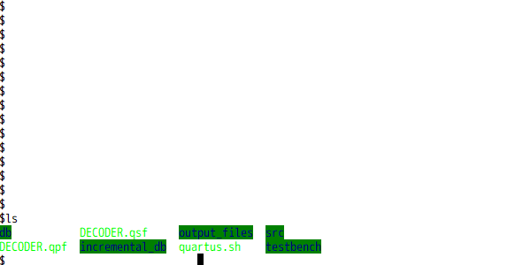
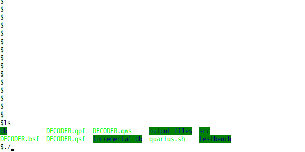
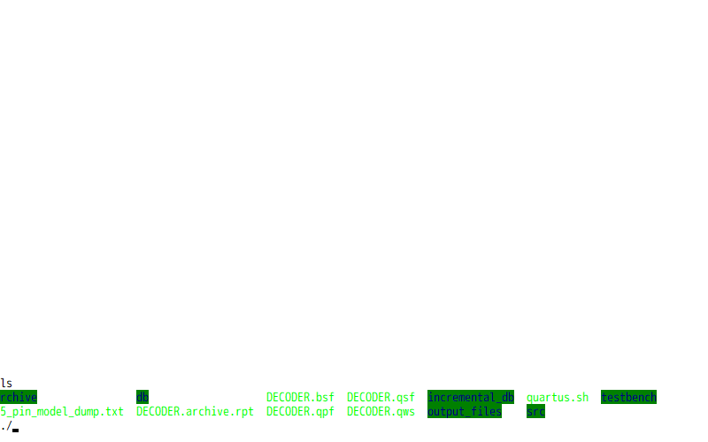
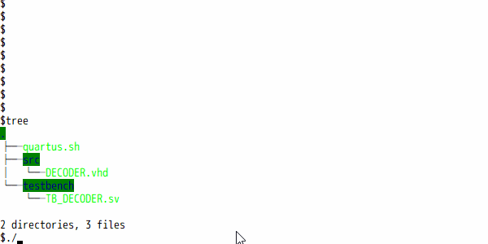
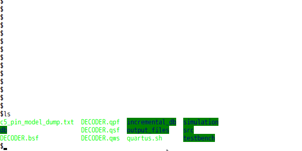
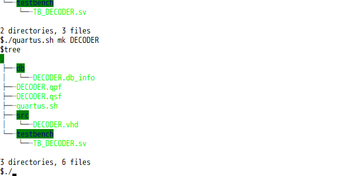
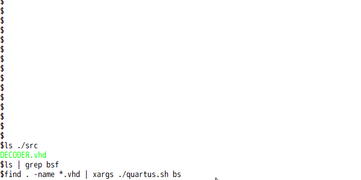

# QuartusCLI

Quartus command line tool on WSL. This script works in WSL bash. 7 different Quartus tools are executed by the argument.

1. Quartus GUI launch(argument is none or project name)
1. Compilation(argument is `sh`)
1. Simulation(argument is `sim`)
1. Make project(argument is `mk`)
1. Archive project(argument is `qar`)
1. Analysis & Synthesis(argument is `map`)
1. Create Block Symbol File(`bsf`)(argument is `bs`)

## Usage

```bash
$ quartus.sh <argument> <project>
```

### e.g.

#### 1. Quartus GUI launch

```bash
$ quartus.sh
```

Quartus GUI is launch.



```bash
$ quartus.sh <project>
```

Quartus GUI is launch and PROJECT.qpf opens.

#### 2. Compilation

```bash
$ quartus.sh sh
Info: *******************************************************************
Info: Running Quartus Prime Shell
~
Info: Command: quartus_sh --flow compile <project>
Info: Quartus(args): compile <project>
~
```

Compilation of current directory project starts.



```bash
$ quartus.sh sh <project>
Info: *******************************************************************
Info: Running Quartus Prime Shell
~
Info: Command: quartus_sh --flow compile <project>
Info: Quartus(args): compile <project>
~
```

Compilation of project that is specified by the argument starts.

#### 3. Simulation

It works similarly argument `sh`. Start NativeLink [^1] simulation and simulate with ModelSim. Script file(`./simulation/modelsim/<project>_run_msim_rtl_*_.do`) is generated by NativeLink. The script file is overwritten by the second executions.

```diff
- vsim -t 1ps -L altera ~
+ vsim -t 1ns -msgmode both -displaymsgmode both -L altera ~
- add wave *
+ add wave -hex *
```

If ModelSim is already running, it will not start up.

[^1]:[Running Simulation Using the Quartus II NativeLink Software](https://www.intel.com/content/www/us/en/programmable/support/support-resources/design-examples/design-software/simulation/modelsim/simulation-nativelink-howto.html?wapkw=nativelink)



#### 4. Make project

```bash
$ quartus.sh mk <project>
```

Quartus project is made. Source files(VHDL`.vhd`, Verilog HDL`.v`, Block Diagram/Schematic File`.bdf`) are added in project. System verilog testbench file that file name begins with `TB_` is added to the NativeLink simulation.



#### 5. Archive project

```bash
$ quartus.sh qar <revision>
Info: *******************************************************************
Info: Running Quartus Prime Shell
~
Info: Command: quartus_sh --archive -output ./archive/<project>_<revision>_YYMMDD/<project>_<revision>_YYMMDD PROJECT
Info: Quartus(args): -qar -output ./archive/<project>_<revision>_YYMMDD/<project>_<revision>_YYMMDD <project>
```

Archive project. `.qar` file is put in `./archive` directory. The below source files list are copied in `./archive/src` directory.

- VHDL(`.vhd`)
- Verilog HDL(`.v`)
- Block Diagram/Schematic File(`.bdf`)
- Block Symbol File(`bsf`)
- Quartus IP file(`.qip`)
- Qsys design file(`.qsys`)

 Programing files(`.sof`, `.pof`, `.jic`) are also copied `./archive/output_files` directory.



#### 6. Analysis & Synthesis

It works similarly compile(argument `sh`).



#### 7. Create Block Symbol File

```bash
$ quartus.sh bs <file>
```

Create Block Symbol File.



### note

`$quaruts_bin` specifies Quartus installation directory on WSL. e.g. Quartus Prime 18.0 is `/mnt/c/intelFPGA_lite/18.0/quartus`. 

`$nativelink_dir` is  specifies Quartus installation directory on **NOT WSL, but windows**. e.g. `C:/intelFPGA_lite/18.0/quartus`.

`$modelsim_bin` specifies ModelSim installation directory on WSL. e.g. ModelSimASE installed with Quartus Prime 18.0 is `/mnt/c/intelFPGA_lite/18.0/modelsim_ase`. 

## License

MIT License

## Author

[toms74209200](<https://github.com/toms74209200>)